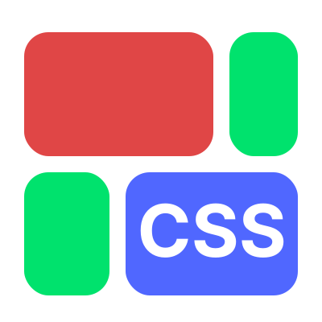

  
  <h2>GridCSS</h2>
  <code style="padding:10px;">https://cdn.jsdelivr.net/gh/FCzajkowski/GridCSS/grid.css</code>
   
   
  
 

  

-----

> [!IMPORTANT]
> Project is still in early development, there might be some issues. If any accure, please **create new issue**

> [!NOTE]
> Framework does not have any Javascript dependencies
### What's Inside

- **Container** - Centered and fluid layouts
- **Flexbox** - Direction, alignment, wrapping utilities
- **CSS Grid** - 1-12 column grid systems
- **Spacing** - Margin and padding classes
- **Sizing** - Width and height controls
- **Display** - Show/hide and positioning
- **Responsive** - Mobile-first breakpoints (sm, md, lg)

### Documentation
[Documentation](DOCUMENTATION.md)

### Contributing

Contributions are always welcome!

See `contributing.md` for ways to get started.

Please adhere to this project's `code of conduct`.

